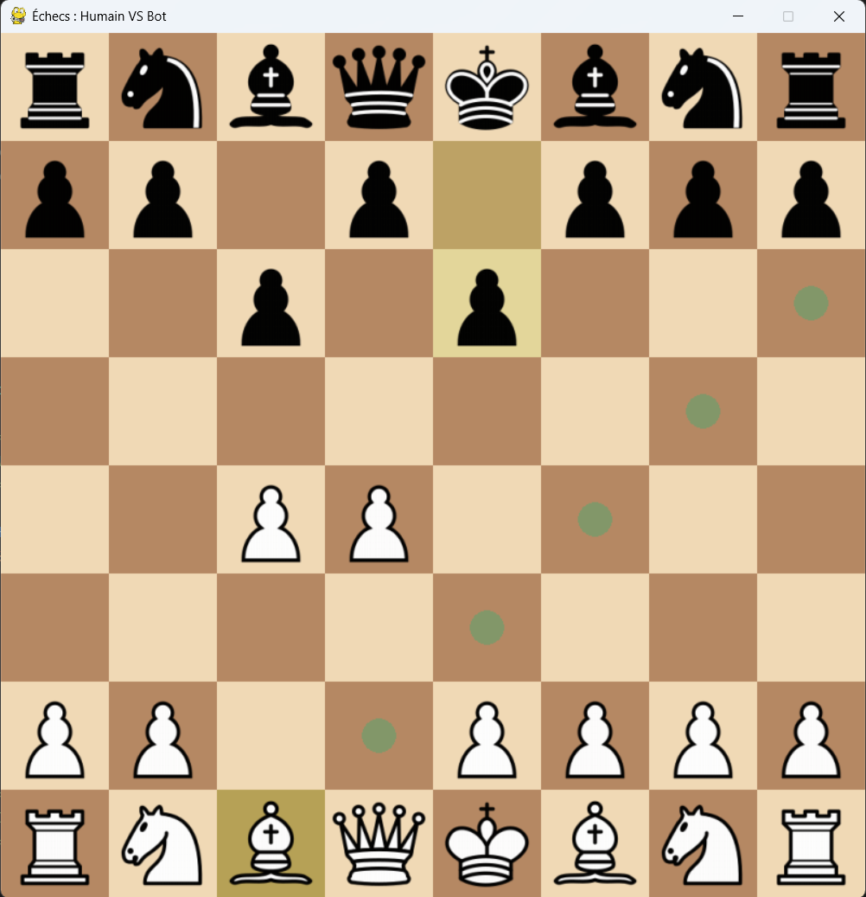
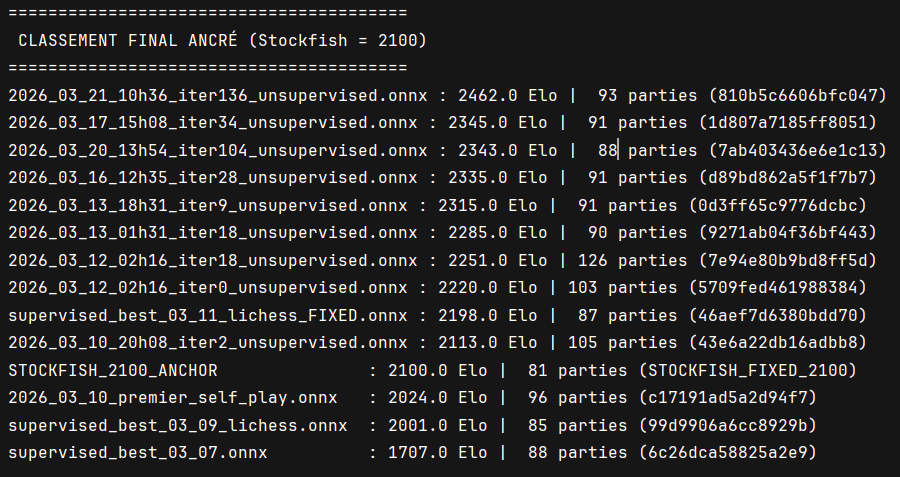

# AlphaChess-Zero: Custom C++ Engine & AlphaZero-style RL

A complete Chess ecosystem built from scratch, featuring a high-performance C++ move-generation engine and a Reinforcement Learning pipeline based on the AlphaZero architecture. The model is trained on a single laptop and achieves an elo of around 2500.



## 🚀 Overview

The goal of this project was to implement a deep learning-based chess entity on a single laptop. To overcome hardware limitations, the project follows a two-stage learning process:
1. **Supervised Learning (SL):** Initializing the policy and value networks using a dataset of Grandmaster games and high-level Lichess games (freely available on [Lichess Datasets](https://database.lichess.org/)).
2. **Reinforcement Learning (RL):** Improving the model through self-play using Monte Carlo Tree Search (MCTS).



## 🆚 Differences from the Original AlphaZero

While the core architecture heavily relies on DeepMind's 2017 paper, several adaptations were made to allow efficient training on a consumer-grade laptop (RTX 3070):

- **Supervised Initialization:** Instead of starting from purely random weights (Zero-knowledge), the Policy and Value networks were pre-trained on a dataset of Grandmaster and high-level Lichess games. This massively accelerates the initial grasp of chess fundamentals.
- **Optimizer:** The original implementation used SGD with Momentum and manual step decay. This project uses **AdamW**, which provides decoupled weight decay and faster, more stable convergence for this scale.
- **Compute-Aware Self-Play (Fast/Slow Moves):** To maximize hardware efficiency, self-play games mix "fast" moves (100 MCTS simulations) and "slow" moves (700 simulations). This generates more terminal game states to train the Value head faster, while maintaining enough deep MCTS searches to provide high-quality targets for the Policy head.
- **First Play Urgency (FPU):** In DeepMind's paper, unvisited MCTS nodes are initialized with a Q-value of 0. In this engine, inheriting [LeelaChessZero](https://github.com/LeelaChessZero/lc0)'s approach, unvisited nodes inherit their parent's value. This reduces catastrophic blunders during early exploration.
- **Network Size & Pipeline:** The ResNet is scaled down (10 blocks, 128 filters vs 20 blocks, 256 filters) to fit local VRAM constraints. The training loop is synchronous (Self-Play -> Train -> Evaluate) rather than fully asynchronous across thousands of TPUs.

## 🛠 Core Features

### ⚡ High-Performance C++ Engine
Unlike many Python-based RL projects, this engine is built in **C++17** for maximum efficiency:
- **Custom Move Generator:** No external chess libraries used. Every rule (castling, en passant, promotion) is implemented from scratch.
- **Speed:** Move execution—including SAN (Standard Algebraic Notation) parsing, move validation, and board state update—takes approximately **0.01ms**.
- **Pybind11 Integration:** The core logic is exposed to Python as a highly optimized module (`chess_engine`), allowing the RL loop to interact with the C++ state without overhead.

### 🧠 AlphaZero Pipeline
- **Zero-Knowledge Philosophy:** The engine provides no heuristic evaluation; the model learns purely from board geometry and game outcomes.
- **MCTS (Monte Carlo Tree Search):** A purely sequential and optimized MCTS implementation in Python (using PyTorch) for decision-making during self-play and evaluation.
- **Model Architecture:** A deep Residual Convolutional Neural Network (ResNet) with Policy and Value heads.

### 📊 Evaluation & Tournament System
- **WHR (Whole History Rating):** Instead of a simple Elo, the project uses a WHR system to track the relative strength evolution of different model iterations.
- **Dynamic Tournament:** A script manages matches between bots. New models are automatically challenged by the current "Champion" to ensure accurate ranking.

### 🖥 GUI & Tools
- **Custom GUI:** A Pygame-based interface to play against your trained models in real-time.
- **Dataset Pipeline:** Tools to extract, clean, and shard Lichess/GM data into a binary format for high-speed training.

## 📂 Project Structure

### C++ Source (`/src`)
- `chessboard.cpp/hpp`: Core board representation and move validation.
- `pgn_parser.cpp/hpp`: High-speed PGN/SAN string processing.
- `bindings.cpp`: Pybind11 bridge definitions.
- `piece.cpp`, `square.cpp`, `move.cpp`: Atomic chess entities.
- `mcts.cpp`: Logic for the tree search.

### Python Source (`/python_src`)
- `model.py`: PyTorch implementation of the ResNet.
- `train_supervised.py`: Script for the initial imitation learning phase.
- `train_self_play.py`: The RL loop (multi-processed on CPU for game generation, GPU for training).
- `evaluate_elo.py`: Tournament manager using the WHR algorithm.
- `play_against_bot.py`: Visual GUI for human-vs-bot matches.
- `lib.py`: Common utilities for move decoding and model loading.

## 📈 Performance & Technical Notes

- **Independent Logic:** This project does **not** rely on `python-chess` for game simulation. All chess logic is handled by the custom C++ core.
- **Resource Optimization:** Game generation is parallelized across CPU cores using Python's `multiprocessing` to saturate the hardware during the Self-Play phase, while the GPU is reserved for neural network backpropagation.

## 🛠 Installation & Build

### Prerequisites
- CMake (>= 3.14)
- C++17 Compiler
- Python 3.11+
- PyTorch & CUDA

### Build the C++ Engine
```bash
mkdir build
cd build
cmake ..
cmake --build . --config Release
```

This will generate the chess_engine shared library in the python_src folder.

### 🎮 Usage
- Train Supervised: python python_src/train_supervised.py

- Start Self-Play: python python_src/train_self_play.py

- Run Tournament: python python_src/tournament_elo.py

- Play against Bot: python python_src/play_against_bot.py

## 🔮 Future Work & Roadmap

- **Build System Portability:** Refactoring the `CMakeLists.txt` to decouple it from local, hardcoded Conda environments. The goal is to use standard CMake `FindPython` modules to ensure seamless C++ compilation and Python 3.11/Pybind11 integration across any machine or operating system.
- **Asynchronous Batched MCTS:** Transitioning from synchronous single-state MCTS evaluations to asynchronous batched searches. This will allow the C++ engine to group multiple leaf node evaluations and send a single, large tensor to the GPU, massively increasing the self-play generation throughput.
- **Transformer Architecture:** Exploring Attention mechanisms to replace or augment the current ResNet topology, following recent architectural shifts in modern engines like Leela Chess Zero.
- **Lichess Bot Integration:** Connecting the engine to the Lichess.org API to play against human opponents in real-time and gather diverse, out-of-distribution evaluation metrics.
- **Bitboard Representation**: Refactoring the internal board state in C++ to use bitboards. While bitwise operations would further optimize move generation speed, it remains a lower priority since the primary performance bottleneck is the neural network inference during MCTS evaluations.